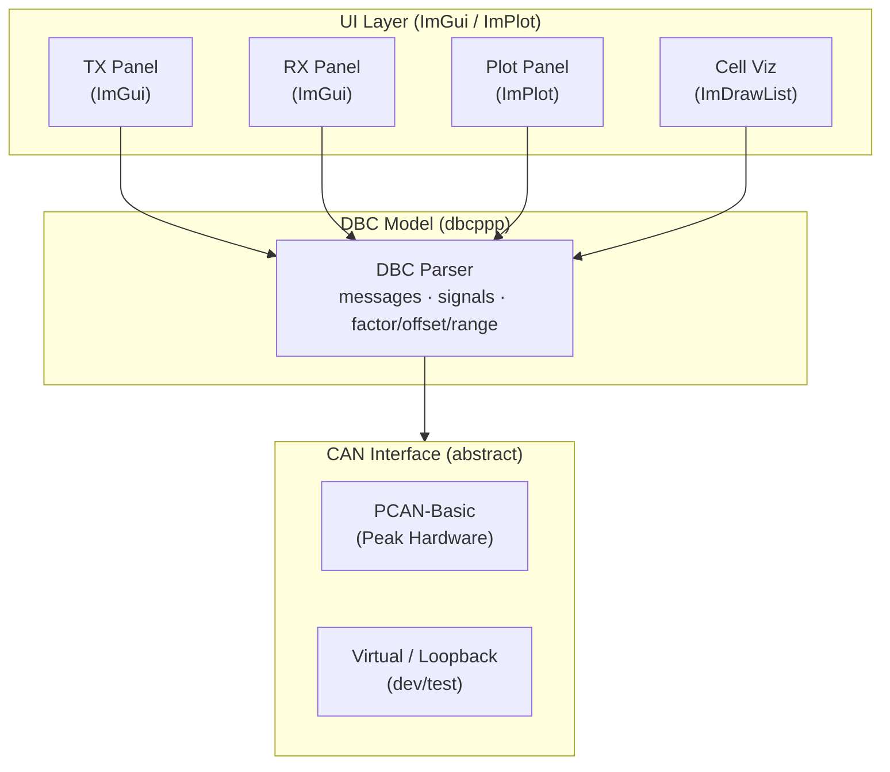
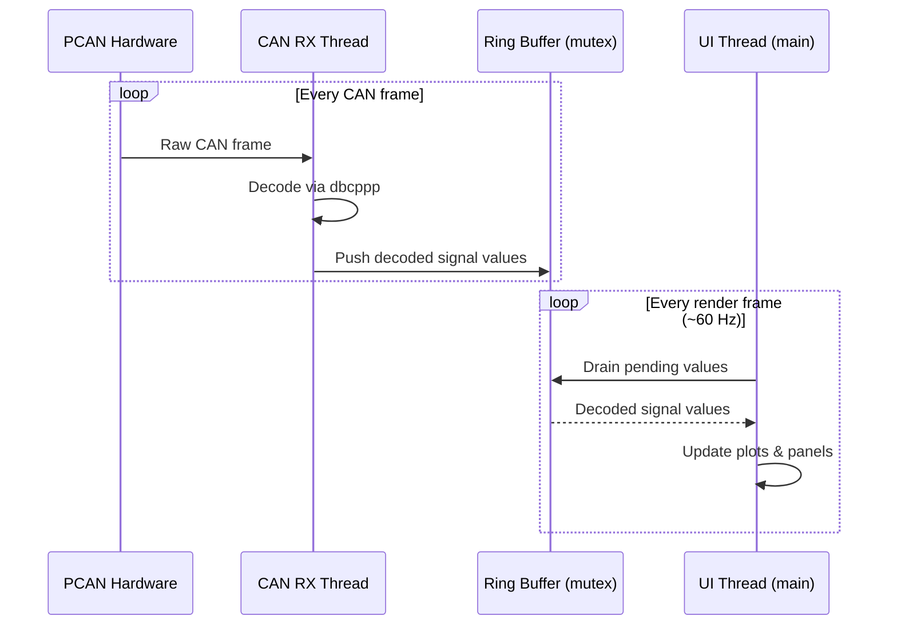
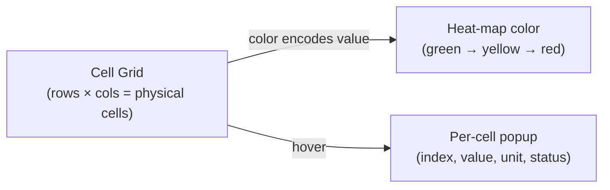

# Architecture

## Layer Diagram

---

## Panels

| Panel | Library | Description |
|---|---|---|
| **TX Panel** | ImGui | Lists all DBC messages the BMU would normally transmit. Each signal has an editable input field. Messages are sent at a configurable cycle rate. |
| **RX Panel** | ImGui | Displays incoming CAN messages decoded against DBC signal definitions — shows signal name, scaled value, and unit. |
| **Plot Panel** | ImPlot | User selects signals from a list; selected signals are rendered as scrolling time-series graphs with pan, zoom, and legend. |
| **Cell Temp Visualization** | ImDrawList | *(Planned)* Grid of cells color-coded by temperature. Hover shows a per-cell popup with detailed info. |
| **Cell Voltage Visualization** | ImDrawList | *(Planned)* Same grid layout, color-coded by voltage. |
| **Cell Balancing Visualization** | ImDrawList | *(Planned)* Grid showing active/inactive balancing state per cell. |

---

## Threading Model

- The **CAN RX thread** runs independently of the UI, blocking on `CAN_Read` from PCAN-Basic.
- Decoded signal values are pushed into a **thread-safe ring buffer** (mutex-guarded).
- The **UI thread** drains the buffer at the start of each render frame to keep display data fresh without blocking rendering.

---

## Cell Visualization Design *(Planned)*

Each cell visualization panel shares the same grid layout concept:

- Grid dimensions are configured to match the physical cell module layout.
- Color mapping uses a configurable min/max range per visualization type.
- The same `ImDrawList` helper will be reused across all three cell panels.
