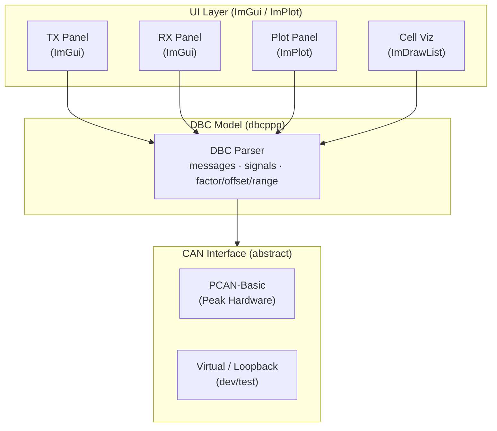
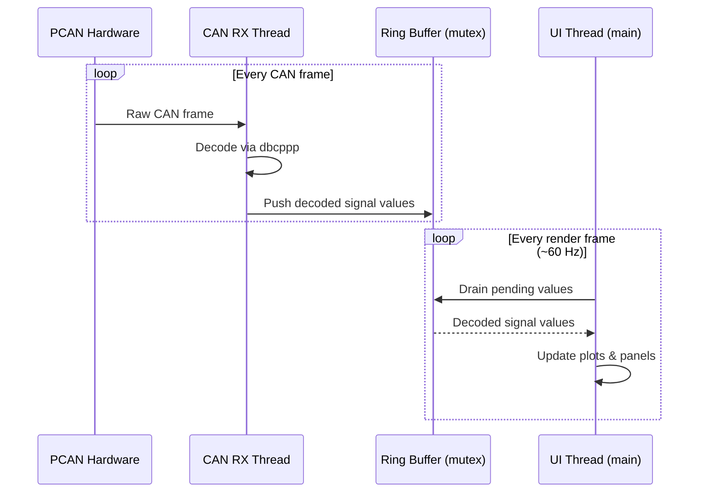
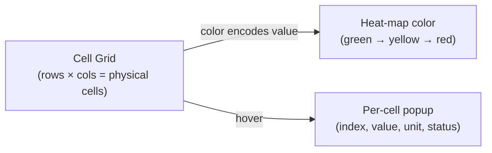

# Architecture

## Layer Diagram

---

## Panels

| Panel | Library | Description |
|---|---|---|
| **Control Panel** | ImGui | BMU command TX controls with optional cyclic transmit, plus decoded BMS state display. |
| **Plot Panel** | ImPlot | User selects signals from a list; selected signals are rendered as scrolling time-series graphs with pan, zoom, and legend. |
| **Cell Temp Visualization** | ImGui Tables + ImDrawList primitives | Module-oriented tiles showing 2 thermistor values per module with summary cards. |
| **Cell Voltage Visualization** | ImGui Tables + ImDrawList primitives | Module-oriented tiles showing 12 cell voltages per module with summary cards. |
| **Cell Balancing Visualization** | ImGui Tables + ImDrawList primitives | Module-oriented tiles showing per-cell balancing current plus two indicators (blue command, green active). |

---

## Threading Model

- The **CAN RX thread** runs independently of the UI, blocking on `CAN_Read` from PCAN-Basic.
- Decoded signal values are pushed into a **thread-safe ring buffer** (mutex-guarded).
- The **UI thread** drains the buffer at the start of each render frame to keep display data fresh without blocking rendering.

---

## Module Visualization Design

Each visualization page uses module-grouped cards with spacing and headers.

- Module header format: `Module XX (Cells A-B)`.
- Temperature page shows 2 thermistor tiles per module.
- Voltage and balancing pages show 12 cell tiles per module.
- Balancing tiles show current in the center and two top-right status lights.
