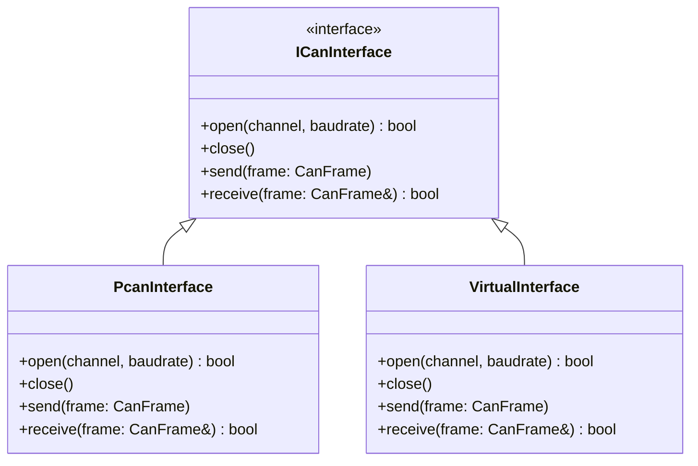

# Design Decisions

## Build System

| Tool | Role |
|---|---|
| **CMake** | Project configuration and build system. |
| **Git submodules (pinned commits)** | Dependency management. Each third-party library is a submodule pointing to a specific release tag/commit for fully reproducible builds. |

---

## Dependencies

### UI & Rendering

| Library | Submodule path | Role |
|---|---|---|
| **Dear ImGui** | `third_party/imgui` | Core GUI framework — windows, widgets, tabs, tooltips, input fields. |
| **ImGui Win32 + DirectX 11 backend** | *(included with ImGui)* | Platform and renderer backend. Standard Windows pairing with no extra dependencies. |
| **ImPlot** | `third_party/implot` | ImGui-native plotting — signal time-series graphs with pan/zoom/legend. |
| **ImDrawList** | *(built into ImGui)* | Custom cell grid rendering (colored rectangles, hover popups). |

### DBC / CAN

| Library | Submodule path | Role |
|---|---|---|
| **dbcppp** | `third_party/dbcppp` | Parses `.dbc` files — enumerates messages, signals, scaling, offset, min/max, value tables. |
| **PCAN-Basic API** | `third_party/pcan` | CAN bus TX/RX via Peak PCAN hardware. Wrapped behind an abstract `ICanInterface` so alternative drivers can be added later. |

### Platform / Utility

| Library | Role |
|---|---|
| **Win32 API** | Window creation (ImGui backend), native file-open dialog for loading `.dbc` files. |
| **C++ STL** | Containers, threading (`std::thread` / `std::mutex` for CAN RX thread), timing. |

---

## CAN Interface Abstraction

PCAN-Basic is the selected hardware driver, but it is accessed only through an abstract `ICanInterface`. This means:

- A **virtual/loopback** implementation can be substituted for development and testing without hardware.
- A different adapter (e.g., Vector, Kvaser) could be added later by implementing the same interface.

---

## Open Decisions

- [ ] DBC message filtering strategy — how to distinguish BMU TX messages from BMS RX messages (transmit-only vs. receive-only node lists, or manual selection in UI).
